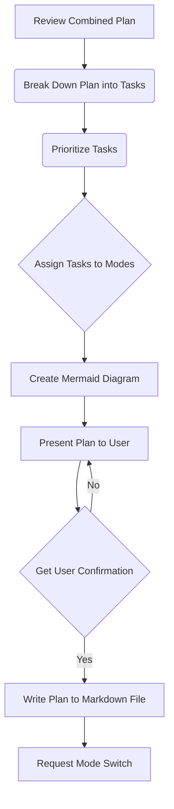

# Detailed Incremental Clicker Implementation Plan

## 1. Review Combined Plan

* Carefully review the `combined_incremental_clicker_plan.md` file to understand all the features and elements that need to be implemented.

## 2. Break Down Plan into Tasks

* Break down the combined plan into smaller, more manageable tasks. This will involve identifying the specific steps required to implement each feature.

## 3. Prioritize Tasks

* Prioritize the tasks based on their importance and dependencies. Core features like the score state, game loop, and click actions will be prioritized first.

## 4. Assign Tasks to Different Modes

* Determine which mode is best suited for each task. For example, code-related tasks will be assigned to the code mode, while UI/UX design tasks might be assigned to a design mode (if available).

## 5. Create Mermaid Diagram

* Create a Mermaid diagram to visualize the overall workflow and dependencies between the different tasks.

## 6. Present Plan to User

* Present the detailed plan, including the Mermaid diagram, to the user for review and approval.

## 7. Get User Confirmation

* Ask the user if they are pleased with the plan or if they would like to make any changes.

## 8. Write Plan to Markdown File

* Once the user confirms the plan, write it to a markdown file.

## 9. Request Mode Switch

* Use the `switch_mode` tool to request that the user switch to another mode to implement the solution.
